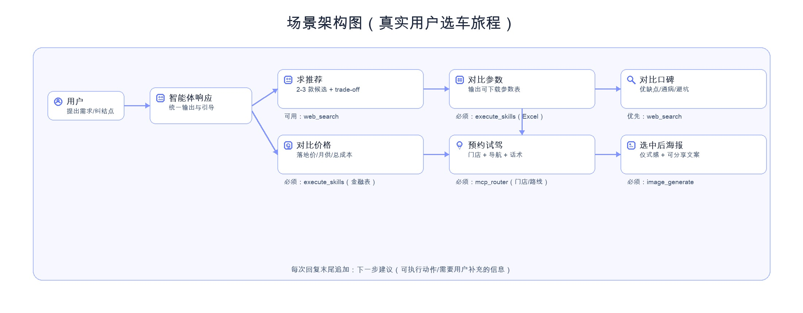
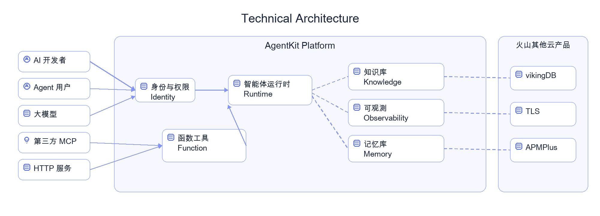

# AgentKit Smart Car Selector

**AgentKit Smart Car Selector** is a “single unified agent” sample built on top of [AgentKit](https://github.com/bytedance/agentkit). It simulates a real car-buying journey end-to-end: recommendations, spec comparison (downloadable table), reputation checks, price/finance analysis (downloadable table), test-drive planning (store & navigation), and a shareable poster after the final pick.

The main design is **Single Agent + Tools/Skills**: keep the system simple to deploy while still delivering deterministic, verifiable artifacts (Excel sheets, images, map routes).

## Highlights

- Real user journey: Recommend → Specs → Reputation → Finance → Test Drive → Poster
- Verifiable outputs: downloadable Excel sheets with reusable formulas
- Fact-check first: use `web_search` for specs/policy/reputation when needed
- Delivery execution (optional): if `mcp_router` is enabled, use it for POI / route / navigation; otherwise provide store-search guidance and an actionable checklist.
- Emotional value: `image_generate` for shareable posters and copy
- Fun fallback: dice-based “mystic pick” when users can’t decide

## Project Layout

```text
.
├── agent.py                    # Unified agent
├── agentkit-agent.py           # A2A server entry
├── agentkit.yaml               # AgentKit config (redacted)
├── instruction.md              # System prompt (full car-buying journey)
├── utils.py
├── requirements.txt
├── pyproject.toml
├── project.toml
├── ENV.md
├── img/
└── skills/

skills/
└── dice-roller/                # dice “mystic pick” skill
```

## Quick Start (Local)

```bash
python3 -m pip install -r requirements.txt
python3 agentkit-agent.py
python3 -c "import requests; print(requests.get('http://127.0.0.1:8000/ping', timeout=5).text)"
```

This project uses many environment variables. See [ENV.md](ENV.md). Copy `.env.example` to `.env` and fill required values (do not commit secrets).

## Architecture Diagrams





## Typical User Flow

1. Ask for recommendations with your budget/city/use-case.
2. Ask for a spec comparison table (“export an Excel table”).
3. Ask for reputation checks (“common issues / owner feedback”).
4. Ask for price & finance analysis (“OTD / monthly payment / amortization table”).
5. Ask for test-drive planning (“find stores / navigation / appointment script”).
6. Ask for a shareable poster after you pick a model.

## Required Files (Marketplace / Packaging)

- `README.md` / `README_en.md`: project documentation (Chinese / English).
- `requirements.txt`: dependency list for local development.
- `pyproject.toml`: optional local packaging metadata for Python tools.
- `project.toml`: application marketplace metadata.
- `LICENSE`: license file (Apache-2.0 by default).
