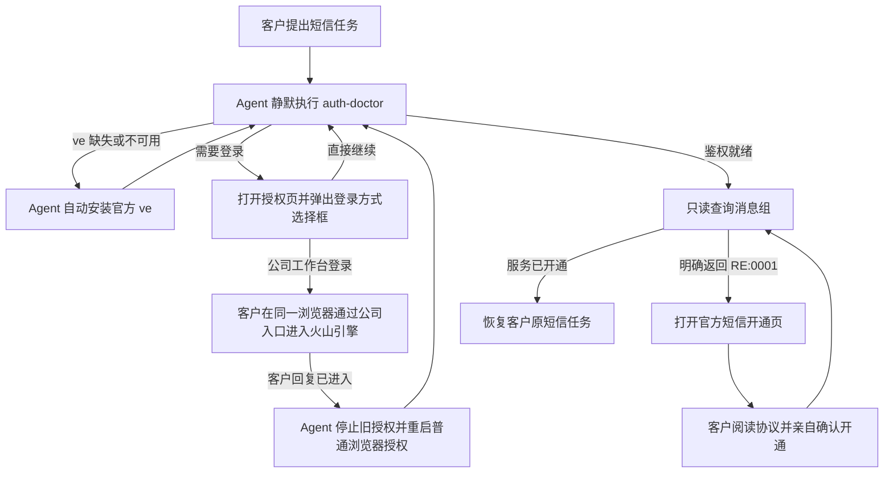

# byted-sms-sender 本分支改动说明

## 文档范围

- 分支：`feat/sms-qualification-display-adapters`
- 对比基线：仓库默认分支 `main`
- Skill 版本：`1.3.1` → `1.5.0`
- 覆盖范围：本分支相对 `main` 的全部 SMS Skill 改动
- 目标用户：没有研发能力、不了解 CLI、AK/SK、环境变量和沙箱的普通客户

本分支的两个已提交变更为 `77c956a8 feat(sms): 优化首次鉴权与登录流程` 和
`d75237a4 feat(sms): 增加服务开通引导`。`6f50fbc9 短信 Skill 移除 ArkClaw 网关鉴权`
已经位于 `main` 基线中，因此不作为本分支成果重复计算。

## 一句话结论

本分支解决的核心问题是：旧版 Skill 默认“CLI、鉴权和短信服务都已经准备好”，普通
客户第一次使用时会在安装、登录、目录权限、公司登录或服务未开通处中断，并被要求
自己操作终端。

改动后，Agent 会自动完成环境检查、CLI 安装、网页登录、鉴权复检和任务恢复；遇到
公司登录或短信服务未开通时，也有明确的引导闭环。客户通常只需要在浏览器里完成
登录、授权、协议确认等必须由本人完成的动作。

## 改动前的主要问题

| 问题 | 原来的客户体验 | 根因 |
| --- | --- | --- |
| 首次使用没有鉴权引导 | Agent 直接报错，给出命令、环境变量或多种方案，让客户自行处理 | Skill 假设凭证已经准备好，没有统一的就绪检查和恢复动作 |
| 没有安装 `ve` | 客户被要求先安装 CLI；如果机器没有 npm，流程直接中断 | 缺少 CLI 存在性、版本、能力检查和无 npm 安装方案 |
| 沙箱不能写用户主目录 | 登录时报 `operation not permitted`，Agent 建议修改 `~/.volcengine` 权限 | `ve` 默认写用户主目录，受限 Agent 环境没有写权限 |
| 远程登录反复失败 | 授权响应交给了另一个进程，出现 `state mismatch`，或后台进程被回收 | OAuth state 和 PKCE verifier 只存在于发起登录的同一个 `ve` 进程中 |
| 公司登录路径不明显 | 登录说明埋在大段文字里，客户容易忽略，也可能误以为必须输入独立账号密码 | 登录方式没有使用平台的结构化选择控件，Agent 也没有稳定等待同一个登录任务 |
| 登录成功后再次要求确认 | 第一次授权已经成功，Agent 却再次打开授权页 | Python 尝试向只读 Skill 目录写 `__pycache__`，沙箱警告掩盖了登录成功；Agent 未先复诊就重复登录 |
| 短信服务未开通 | 鉴权成功后仍停在 API 错误，客户不知道必须先开通产品 | Skill 只覆盖开通后的短信操作，没有识别和引导开通 |
| 部分 CLI 失败仍可能触发写请求换路 | `main` 已能保护多数结果未知场景，但部分英文错误文本仍会被当成“请求未发出”，且退出成功但没有有效响应的边界没有完全收口 | 写请求是否允许 fallback 仍部分依赖 CLI 自然语言，而不是只依赖结构化执行阶段 |

## 本分支如何解决这些问题

### 1. 把首次鉴权改成 Agent 自动闭环

新增 `auth-doctor` 作为首次调用和鉴权失败时的统一入口。它负责检查：

- `ve` 是否存在、版本是否满足最低要求；
- 当前 CLI 是否支持远程登录、短信 Action 和 STS 身份自检；
- 当前凭证是否真的可用，而不是只检查缓存文件是否存在；
- 配置目录是否可写，以及环境变量或 `.env` 是否只配置了一半。

诊断失败时不再输出一组排障建议，而是返回唯一的结构化 `remediation`。Agent 按原样
执行安装、登录、复诊或清理动作，成功后自动恢复客户最初的短信任务。

对普通客户，默认不展示命令、JSON、错误码、CLI 版本、Profile、HOME、AK/SK 状态
或多种解决方案，也不要求客户回复“登录成功”。

### 2. 没有 `ve` 或 npm 也能继续

当 `ve` 缺失、版本过低或能力不完整时，Skill 返回自动安装动作：

- npm 可用：安装官方 `@volcengine/cli@1.1.1`；
- npm 不可用：下载与操作系统、CPU 架构匹配的官方 Release，并按官方清单校验
  SHA-256，安装到用户可写路径；
- 安装后验证版本和能力，再重新执行 `auth-doctor`。

因此 Node/npm 不再是客户必须提前准备的条件，安装过程也不需要普通客户操作终端。

### 3. 默认走浏览器自动回跳

默认登录使用本机浏览器回调：Agent 启动登录后立即告诉客户浏览器里需要完成什么，
然后保持原进程等待自动回跳。浏览器已有可复用登录态时，客户可能只需确认授权；没有
登录态时，客户按页面完成登录、MFA 和授权。

只有确认浏览器与 CLI 不共享 loopback 时才使用远程模式。远程模式必须满足：

- 原登录进程持续存活且前台会话可读写；
- Agent 能读取授权结果页；
- 页面给出的完整不透明响应串被原样写回同一个进程的 stdin。

否则立即停止，不让客户把授权码发到对话，也不通过后台进程、文件、环境变量或新的
登录进程转交授权响应。这避免了 `state mismatch` 和授权制品泄露。

### 4. 所有登录缓存默认写系统临时目录

所有 `ve` 子进程默认使用操作系统临时目录中的 Skill 私有 HOME，而不是用户主目录、
仓库目录或固定的 `/tmp/ve-home`：

- macOS/Linux 使用系统临时目录；
- Windows 使用 `%TEMP%`，并同步设置 `USERPROFILE`；
- 正常路径使用按当前用户命名的稳定运行目录，使登录状态可以跨任务复用；
- 默认目录不可用时，权限补救路径才创建随机私有目录；
- 登录、复诊和后续短信命令始终复用同一个 HOME；
- 随机补救目录在流程结束后只通过受控的 `auth-cleanup` 删除；稳定运行目录不会在每个
  任务结束时清理。

创建、复用和删除前都会校验目录必须位于系统临时目录直属层级、名称符合 Skill 前缀、
不是符号链接且可写。POSIX 系统还会校验目录归当前用户所有并限制为 `0700`；
Windows 不套用 POSIX owner/mode 语义。校验或清理失败时停止，不尝试修改
`~/.volcengine`，也不执行或建议 `sudo`、`chown`、`chmod`。

这解决了 Trae Work 等受限环境中“能启动浏览器，但无法把凭证写入用户主目录”的
问题，同时兼容 macOS、Linux 和 Windows。

### 5. 用选择框区分直接授权与公司登录

Agent 先静默启动浏览器授权，并把登录进程作为可寻址的异步 job 保留下来；随后立即
调用 Trae Work、WorkBuddy 等平台的结构化选择工具，显示独立选择框：

- `直接继续（推荐）`：客户可以在已打开的页面完成授权；
- `公司工作台登录`：客户平时从公司工作台进入火山引擎。

选择框不再被长段说明淹没，也不以“页面只有账号密码”为前提。选择直接继续后，Agent
等待同一个 job，浏览器回跳成功即由 `auth-login` 自动复诊并恢复原任务；客户无需再
回复“登录完成”。如果客户在选择前已经授权成功，Agent 忽略或关闭选择框，直接继续，
避免重复点击确认授权。

选择公司登录后，Agent 会先检查当前授权 job，在后续等待期间持续观察，并在准备重启
授权前再检查一次。如果客户其实已经在授权页完成确认，job 返回 `auth_ready` 后会立即
结束公司登录引导并恢复原任务，不再要求回复“已进入”，也不会打开第二次授权。

只有当前授权仍未完成时，才显示这一条动作：

> 请在同一个浏览器中，从公司工作台进入火山引擎控制台；看到控制台后回复“已进入”。

收到回复后，Agent 终止并等待旧登录进程退出，废弃旧 OAuth state，复用原 Profile、
临时 HOME 和清理上下文重新启动一次普通授权。再次无法授权时先停止登录再清理，不
循环、不索取企业链接、不执行 `ve configure sso`，也不主动改走 AK/SK。

所有 Python 入口使用 `-B`，避免在只读 Skill 目录生成字节码。`auth_ready` 前禁止询问
号码和短信内容、执行短信命令或结束任务；登录结果必须来自同一个 job 的最终 JSON。

### 6. 保留 AK/SK 能力，但不把它当成登录失败兜底

短信 API 的最终调用仍使用火山引擎 V4 AK/SK 签名；普通客户和公司登录客户最终都由
官方 CLI 的浏览器授权获取临时 AK/SK/SessionToken。已有环境变量和 `.env` 的兼容
直连能力继续保留，但只有客户明确选择 AK/SK 时才进入配置流程。

Skill 只提示一套标准变量：`VOLCENGINE_ACCESS_KEY`、`VOLCENGINE_SECRET_KEY`，临时
凭证再增加 `VOLCENGINE_SESSION_TOKEN`。凭证不能出现在对话或命令参数中。目录权限、
沙箱限制、CLI 安装失败或一般登录错误，都不会再触发 Agent 主动要求客户提供 AK/SK。

### 7. 防止写操作被重复发送

`main` 已经对多数超时和结果未知的写请求返回 `outcome_unknown`。本分支继续关闭剩余
漏洞，并让 CLI 调用结果保留结构化状态：

- CLI 自然语言错误分类只用于只读调用，不再用来证明写请求“尚未发出”；
- 只读调用只有在确认安全且已有完整凭证时，才允许走兼容直连；
- 写调用一旦启动，超时、异常、非零退出，以及退出成功但没有有效响应，都统一返回
  `outcome_unknown`；
- `outcome_unknown` 不会切换调用路径或自动重放，必须通过对应查询能力对账；
- 组合工作流会保留原始错误码、Request ID、是否可重试和 remediation，不再把所有
  问题压成一个无法处理的通用错误。

这一改动避免“第一次其实已经发出，第二次又通过另一条路径发送”的重复短信风险。

### 8. 增加短信服务开通引导

鉴权就绪后，Skill 先执行一次只读 `list-message-groups`。只有接口明确返回公开错误码
`RE:0001` 时，才判断当前账号未开通短信服务；空列表、无资质、无签名/模板、欠费或
权限错误不会被误判为未开通。

确认未开通后：

1. Agent 自动打开官方短信控制台并定位开通入口；
2. 客户本人阅读服务协议和计费条款，并亲自勾选、确认开通；
3. 开通完成后只重新执行一次只读查询；
4. 查询成功后恢复客户原来的短信任务；尚未生效则保留任务上下文并停止，不循环刷新。

Agent 不代替客户同意协议或点击最终开通按钮。服务开通也不代表已经具备发送条件，
后续仍需检查消息组、资质、签名和模板；没有资质时可在本机向导完成材料、预览并提交
审核。此前失败的写操作不会在开通后自动重放，必须重新生成预览并取得授权。

### 9. 资质申请采用字段级隐私边界

新增一个统一资质申请向导。Agent 启动后在 `127.0.0.1` 临时打开 Skill 内置 HTML
页面。图片由本机 Skill 进程使用短信平台返回的临时 ImageX 凭证直传材料服务，再调用
`GetOCRLicense`；OCR 结果在页面内展示、修改和确认，同时以掩码后的诊断事件供 Agent
排查。

页面按营业证件、经办人、责任人和最终确认逐步展示。法人身份信息放在营业证件页的选填
折叠区，不再混入经办人页；营业证件上的法人姓名是唯一来源、必填且可修改。独立的
法人身份证号、手机号和身份证图片默认
不收集，客户主动补充时才校验。经办人、责任人的图片和手机号按账号规则最少采集。
营业证件、经办人和独立责任人均采用一个“确认并继续”主动作：页面自动保存、校验并在
成功后进入下一步。营业证件自动校验失败可转人工审核；人员校验失败必须修改后重试。
责任人与经办人相同时直接复用
经办人信息和校验票据，不重复填写、上传或校验。最终提交只复用仍与当前草稿对应的票据，
不再在提交按钮后隐藏执行校验。再次保存会整体替换该部分，
递增草稿版本并废弃旧预览。客户在页面内核对最终预览并提交后，CLI 只返回申请 ID、
草稿版本、公开 Request ID 和状态，不输出图片、图片 URI 或证照字段。身份证分别上传
人像面和国徽面，OCR 回填姓名和身份证号，手机号由客户填写，字段均可修改。

营业证件和身份证件图片统一限制为 JPG、JPEG、PNG，单张不大于 2 MB。营业证件
为复印件或黑白照片时，表单要求客户确认已经加盖红色企业公章；彩色图片不要求盖章。
这项判断由客户在本机页面明确选择，不依赖不可靠的图像自动猜测；它只是上传前确认
门禁，不代表系统验证了真实红章，选择和确认状态也不返回 Agent。

资质用途现在支持自用和他用。他用时先读取当前账号规则；只有
`needOtherUseCheck=true` 才显示并要求一张授权委托书，否则不额外收集。重新上传委托书
会替换旧文件并废弃旧预览；从他用切换为自用会从草稿移除委托书。委托书同样只在本机
页面和进程内处理，支持 JPG、JPEG、PNG，单张不大于 2 MB。

资质网络调用通过同一前台会话自动输出统一诊断事件。Agent 默认可读取请求、响应、
HTTP 状态、Request ID 和 Log ID，不再要求客户复制字段、重新打开表单或额外授权排查。
事件在唯一出口集中掩码姓名、身份证号和手机号；图片、文件内容与地址、上传凭证、
Authorization 和校验票据始终不可见。最终回复也不恢复或完整复述被掩码的个人信息。

### 10. 发送前优先复用已有签名和资质

客户只描述短信内容、没有指定资源时，Skill 先按短信类型、审核状态、可用性和消息组关系
筛选已有签名：唯一候选直接推荐，多个候选用结构化选择，没有候选才进入签名申请。
签名申请同样优先复用审核通过、用途一致的资质；唯一候选直接推荐，多个候选让客户选择，
没有候选才打开资质申请向导。短信内容不用于猜测品牌主体，资质和签名申请审核通过后再
从中断处复查资源并恢复原发送任务。选定签名后仍需精确匹配模板，没有逐字节匹配项才申请
新模板，不以相似模板代替。

### 11. 资质向导支持多种展示适配器

资质业务、草稿和 HTML 表单保持单一实现，展示层按宿主已经提供的能力选择：支持 MCP
App 时使用 WorkBuddy 等宿主的内嵌 WebView；支持本机网页预览时由宿主接管一次性
loopback URL；其余环境继续使用系统浏览器。三种路径不能同时启动，系统浏览器始终作为
默认兜底。

新增 stdio MCP Server 和 MCP App HTML 资源。私密 URL 只放在 Tool Result `_meta`，
模型可见字段只包含流程 ID 与安全状态；表单完成后只把申请 ID、Request ID、Log ID、
结果未知或放弃状态送回对话。TRAE 等尚未提供 MCP App 的宿主可以使用内置网页预览或
外部浏览器，无需复制另一套表单。

## 改动后的主流程

## 文件级改动

| 文件 | 作用 |
| --- | --- |
| `skills/byted-sms-sender/SKILL.md` | 版本升级到 1.5.0；按“客户体验、总流程、按需参考、硬性边界”重构，并为资质向导增加能力驱动的展示适配器。 |
| `skills/byted-sms-sender/agents/openai.yaml` | 展示名改为“火山引擎短信（Volcengine SMS）”，并优化短描述和默认提示词。 |
| `skills/byted-sms-sender/references/auth-setup.md` | 集中描述结构化 remediation、登录方式选择框、同 job 完成检测、公司网页登录态建立与授权重启、远程回退、AK/SK 和临时目录规则。 |
| `skills/byted-sms-sender/references/service-onboarding.md` | 定义 `RE:0001` 的唯一开通判定、控制台引导、客户协议确认、复检和禁止重放边界。 |
| `skills/byted-sms-sender/references/actions.md` | 将公开错误码 `RE:0001` 路由到服务开通流程，其余错误继续以官方公开说明为准。 |
| `skills/byted-sms-sender/scripts/api_client.py` | 增加 auth doctor、CLI 版本与能力诊断、结构化 remediation、稳定运行 HOME 与随机补救 HOME、公司浏览器登录 handoff；所有 Python remediation 使用 `-B`，并声明登录会话互斥。 |
| `skills/byted-sms-sender/references/qualification-materials.md` | 规定统一资质向导的草稿替换、字段级隐私边界、预览和单次提交规则。 |
| `skills/byted-sms-sender/references/qualification-display.md` | 按能力选择 MCP App、宿主网页预览或系统浏览器，并给出 MCP Server 的一次性配置契约。 |
| `skills/byted-sms-sender/scripts/qualification_upload.py` | 实现平台 ImageX 临时凭证上传、OCR、账号校验要求、要素校验票据和资质创建调用，并统一输出已掩码的请求、响应和诊断标识。 |
| `skills/byted-sms-sender/scripts/qualification_wizard.py` | 实现统一的本机资质草稿、分区替换、自动校验、最终预览和提交服务。 |
| `skills/byted-sms-sender/scripts/qualification_display.py` | 定义系统浏览器、宿主 URL 交接和内嵌回调三种展示适配器。 |
| `skills/byted-sms-sender/scripts/qualification_mcp_server.py` | 提供 WorkBuddy 可加载的 stdio MCP Server、私密流程管理和安全结果查询。 |
| `skills/byted-sms-sender/assets/qualification_wizard.html` | 实现按账号规则动态展示的现代化资质向导；使用自定义上传卡片替代宿主中显示异常的原生文件控件，每个必需步骤只保留一个“确认并继续”主动作。 |
| `skills/byted-sms-sender/assets/qualification_mcp_app.html` | 承载 MCP App 握手、内嵌本机表单和安全完成状态回传。 |
| `skills/byted-sms-sender/scripts/sms_cli.py` | 增加 `qualification-wizard` 统一入口；CLI 仅接收非敏感结果。 |
| `skills/byted-sms-sender/tests/test_auth_flow.py` | 新增 30 个定向测试，覆盖 CLI 诊断、身份自检、登录后强制复诊、临时目录、清理边界、AK/SK 来源、只读/写 fallback，以及公司网页登录 handoff。 |
| `skills/byted-sms-sender/tests/test_qualification_wizard.py` | 新增 25 个定向测试，覆盖渐进式草稿、自动校验、校验票据复用、法人姓名单一来源、选填法人、本地草稿放弃、内嵌边界、自定义文件上传控件、单次提交，以及请求/响应事件的个人字段掩码与诊断标识。 |
| `skills/byted-sms-sender/tests/test_qualification_display.py` | 新增 5 个展示适配器和 CLI 选择测试。 |
| `skills/byted-sms-sender/tests/test_qualification_mcp_server.py` | 新增 6 个 MCP Tool、UI Resource、私密 URL、流程结果和 stdio 协议测试。 |

## 客户可见的变化

改动前，普通客户容易看到“请安装 CLI”“请执行 export”“请修复目录权限”“请选择一种
鉴权方式”等技术回复。改动后，预期体验是：

- 客户直接说“我想发短信”，Agent 自行检查并补齐运行条件；
- 缺少 CLI 时由 Agent 安装，不要求客户先安装 npm；
- 需要登录时直接打开浏览器，并弹出“直接继续 / 公司工作台登录”选择框；
- 登录完成后自动复诊，已就绪时不会再次打开授权页；
- 公司登录客户不会被要求提供企业链接；在浏览器进入控制台后即可继续普通授权；
- 沙箱目录不可写时不再要求客户执行权限命令；
- 短信服务未开通时自动打开官方开通页，客户完成必要确认后继续原任务；
- 营业执照在本机表单上传和校对，不作为聊天附件进入模型；
- 全程不要求客户在对话中发送 AK、SK、SessionToken、密码、验证码或授权码。

## 验证情况

当前工作区共有 66 个定向测试：鉴权 30 个、资质向导 25 个、展示适配器 5 个、MCP
Server 6 个，覆盖：

- `ve` 缺失、版本解析、最低版本和能力检查；
- STS 就绪检查与身份信息不回显；
- 登录退出状态不明确时仍先复诊，避免重复登录；
- Profile 保留、AK/SK 完整性和凭证来源；
- 系统临时 HOME 的权限、越界、符号链接和补救目录安全清理；
- 只读兼容直连与写操作绝不重放；
- 公司网页登录 handoff、旧 OAuth 状态废弃，以及 Profile、HOME 和 cleanup 上下文保持。
- 资质草稿替换、账号必填规则、单次提交、结果未知，以及请求/响应事件的字段级隐私边界。

最近一次定向验证结果：66/66 通过；页面 JavaScript 语法、Skill frontmatter 和
`git diff --check` 均通过。最终代码审查未发现剩余阻断问题。

## 当前边界

- 客户仍必须亲自完成账号登录、MFA、授权，以及多个账号或角色时的选择；Agent 不能
  代替客户提供密码、验证码或确认身份。
- 公司登录必须在 `ve login` 打开的同一浏览器 Profile 中建立火山引擎控制台登录态；
  另一浏览器、无痕窗口或工作台内嵌页面的登录态不一定能被授权页复用。
- 短信服务协议和计费条款必须由客户本人阅读并确认；当前没有可由 Skill 安全代办的
  产品开通 API。
- 资质向导支持自用和他用；他用授权委托书是否必填由当前账号规则决定。
- 法人材料为可选项；营业证件、经办人和责任人是提交前必填项。
- 鉴权信息保存在操作系统临时目录中的按用户稳定运行目录；随机权限补救目录会按
  remediation 清理。系统清理稳定运行目录后需要重新登录，这是避免写用户主目录的
  有意取舍。
- 如果运行环境无法维持可读写的前台进程，也无法完成安全的浏览器回跳或授权结果交接，
  Skill 会停止，而不是让普通客户在终端或对话中传递敏感信息。

## 成功标准

本分支完成后，应以以下场景作为验收标准：

1. 一台没有 `ve`、甚至没有 npm 的新机器，普通客户只通过会话和浏览器即可进入短信
   业务流程。
2. Agent 不能写用户主目录时，登录缓存仍能安全写入系统临时目录，并在同一任务内持续
   可用。
3. 普通登录客户通过选择框点击“直接继续”后由浏览器自动回跳完成鉴权；公司登录客户
   选择“公司工作台登录”，在同一浏览器进入火山引擎并回复“已进入”后，由 Agent 重启
   普通授权，全程不索取企业链接。
4. 未开通短信服务的账号会进入官方控制台开通引导，完成后恢复原任务，而不是停在 API
   错误。
5. 任何可能已经发出的短信写请求都不会因为 CLI 失败或切换鉴权路径而被自动重复发送。
