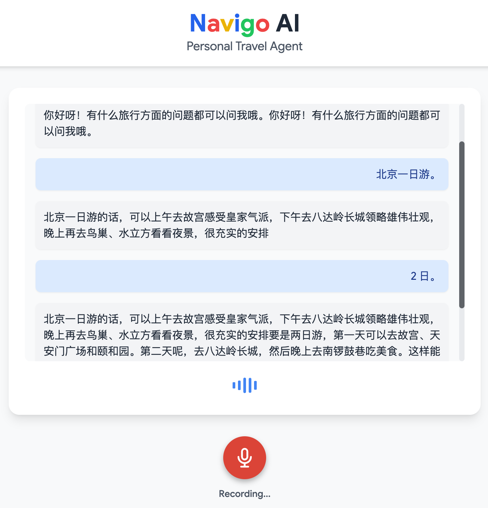

# NaviGo AI - 实时语音助手 Agent

基于火山引擎 VeADK 和 AgentKit 构建的入门级实时语音助手 Agent，展示如何创建一个具备旅行规划能力的 AI Agent。

## 概述

本示例是 AgentKit 与豆包端到端实时语音大模型结合的例子。

## 核心功能

- 创建一个简单的实时语音助手 Agent 实时语音聊天需要同时处理多个任务：听、想、说
- 豆包端到端实时语音大模型API即RealtimeAPI支持低延迟、多模式交互，可用于构建语音到语音的对话工具

## Agent 能力

```text
用户消息
    ↓
AgentKit 运行时
    ↓
NaviGo AI Agent
    ├── VeADK Agent (对话引擎)
    └── 端到端实时语音大模型 (LLM)
```

### 核心组件

| 组件 | 描述 |
| - | - |
| **Agent 服务** | [agent.py](https://github.com/bytedance/agentkit-samples/blob/main/python/01-tutorials/01-agentkit-runtime/realtime_voice/agent.py) - 主应用程序，定义 Agent 处理音频和文本转录 |
| **测试客户端** | [interface.html](https://github.com/bytedance/agentkit-samples/blob/main/python/01-tutorials/01-agentkit-runtime/realtime_voice/client/interface.html) - 基于 HTML5 实现的实时语音助手界面 |
| **项目配置** | [pyproject.toml](https://github.com/bytedance/agentkit-samples/blob/main/python/01-tutorials/01-agentkit-runtime/realtime_voice/pyproject.toml) - 依赖管理（uv 工具） |
| **AgentKit 配置** | agentkit.yaml - 云端部署配置文件 |

### 代码特点

**Agent 定义**（[agent.py](https://github.com/bytedance/agentkit-samples/blob/main/python/01-tutorials/01-agentkit-runtime/realtime_voice/agent.py#L38-L42)）：

```python

agent = Agent(
    name="voice_assistant_agent",
    model=MODEL,
    instruction=SYSTEM_INSTRUCTION,

)

```

**语音配置**（[agent.py](https://github.com/bytedance/agentkit-samples/blob/main/python/01-tutorials/01-agentkit-runtime/realtime_voice/agent.py#L72-L84)）：

```python
# Create run config with audio settings
run_config = RunConfig(
    streaming_mode=StreamingMode.BIDI,
    speech_config=types.SpeechConfig(
        voice_config=types.VoiceConfig(
            prebuilt_voice_config=types.PrebuiltVoiceConfig(
                voice_name=VOICE_NAME
            )
        )
    ),
    response_modalities=["AUDIO"],
    output_audio_transcription=types.AudioTranscriptionConfig(),
    input_audio_transcription=types.AudioTranscriptionConfig(),
)
```

## 目录结构说明

```bash
realtime_voice/
├── agent.py           # Agent 应用入口
├── core_utils.py      # 核心工具函数（如音频处理）
├── client/            # 测试客户端目录
│   ├── interface.html # 实时语音助手界面（HTML5 + WebSocket）
├── requirements.txt   # Python 依赖列表 （agentkit部署时需要指定依赖文件)
├── pyproject.toml     # 项目配置（uv 依赖管理）
├── agentkit.yaml      # AgentKit 部署配置（运行agentkit config之后会自动生成）
├── Dockerfile         # Docker 镜像构建文件（运行agentkit config之后会自动生成）
└── README.md          # 项目说明文档
```

## 本地运行

### 前置准备

**1. 开通豆包实时语音模型服务：**

- 访问 [火山控制台](https://console.volcengine.com/speech/new/setting/activate?projectName=default)
- 开通端到端实时语音模型服务

**2. 获取APP_ID 和 API_KEY：**

- 参考 [控制台使用FAQ](https://www.volcengine.com/docs/6561/196768?lang=zh#q1%EF%BC%9A%E5%93%AA%E9%87%8C%E5%8F%AF%E4%BB%A5%E8%8E%B7%E5%8F%96%E5%88%B0%E4%BB%A5%E4%B8%8B%E5%8F%82%E6%95%B0appid%EF%BC%8Ccluster%EF%BC%8Ctoken%EF%BC%8Cauthorization-type%EF%BC%8Csecret-key-%EF%BC%9F) 获取 APP_ID 和 API_KEY

**3. 获取火山引擎访问凭证：**

- 参考 [用户指南](https://www.volcengine.com/docs/6291/65568?lang=zh) 获取 AK/SK

### 依赖安装

#### 1. 安装 uv 包管理器

```bash
# macOS / Linux（官方安装脚本）
curl -LsSf https://astral.sh/uv/install.sh | sh

# 或使用 Homebrew（macOS）
brew install uv
```

#### 2. 初始化项目依赖

```bash
# 进入项目目录
cd python/01-tutorials/01-agentkit-runtime/realtime_voice
```

使用 `uv` 工具来安装本项目依赖：

```bash
# 如果没有 `uv` 虚拟环境，可以使用命令先创建一个虚拟环境
uv venv --python 3.12

# 使用 `pyproject.toml` 管理依赖
uv sync

# 激活虚拟环境
source .venv/bin/activate
```

### 环境准备

```bash
# 豆包端到端实时语音大模型名称
export MODEL=doubao_realtime_voice_model
# 豆包端到端实时语音大模型APP_ID 和 API_KEY
export MODEL_REALTIME_APP_ID=<Your APP_ID>
export MODEL_REALTIME_API_KEY=<Your API_KEY>

# 火山引擎访问凭证（必需）
export VOLCENGINE_ACCESS_KEY=<Your Access Key>
export VOLCENGINE_SECRET_KEY=<Your Secret Key>

```

### 调试方法

#### 方式一：命令行测试

```bash
cd python/01-tutorials/01-agentkit-runtime/realtime_voice

# 启动 Agent 服务
uv run agent.py
# 服务将监听 http://0.0.0.0:8000

# 新开客户端
# 在浏览器中打开 client/interface.html，客户端将自动连接到 WebSocket 服务器。
```

**运行效果**：



## AgentKit 部署

### 前置准备

**重要提示**：在运行本示例之前，请先访问 [AgentKit 控制台授权页面](https://console.volcengine.com/agentkit/region:agentkit+cn-beijing/auth?projectName=default) 对所有依赖服务进行授权，确保案例能够正常执行。

**1. 开通豆包实时语音模型服务：**

- 访问 [火山控制台](https://console.volcengine.com/speech/new/setting/activate?projectName=default)
- 开通端到端实时语音模型服务

**2. 获取APP_ID 和 API_KEY：**

- 参考 [控制台使用FAQ](https://www.volcengine.com/docs/6561/196768?lang=zh#q1%EF%BC%9A%E5%93%AA%E9%87%8C%E5%8F%AF%E4%BB%A5%E8%8E%B7%E5%8F%96%E5%88%B0%E4%BB%A5%E4%B8%8B%E5%8F%82%E6%95%B0appid%EF%BC%8Ccluster%EF%BC%8Ctoken%EF%BC%8Cauthorization-type%EF%BC%8Csecret-key-%EF%BC%9F) 获取 APP_ID 和 API_KEY

**3. 获取火山引擎访问凭证：**

- 参考 [用户指南](https://www.volcengine.com/docs/6291/65568?lang=zh) 获取 AK/SK

### AgentKit 云上部署

#### 1. 生成部署配置

```bash
cd python/01-tutorials/01-agentkit-runtime/realtime_voice

# 根据命令行提示配置项目，并生成 agentkit.yaml 和 Dockerfile
agentkit config
```

配置完成后，请检查生成的 `agentkit.yaml`，确认应用入口、监听端口和运行时
环境变量符合当前项目。模型密钥、AK/SK 等敏感信息应通过 AgentKit 控制台或
环境变量配置，不要直接写入配置文件并提交到代码仓库。

#### 2. 启动云端服务

```bash
cd python/01-tutorials/01-agentkit-runtime/realtime_voice

agentkit launch
```

部署成功后，Runtime 链接信息会自动保存到 `agentkit.yaml`。访问凭证应保存在
环境变量或密钥管理服务中，不要硬编码到客户端代码、URL 或 Git 仓库。

#### 3. 验证部署结果

建议先使用 AgentKit CLI 验证云端服务，再接入自定义页面：

```bash
agentkit status
agentkit invoke "你好，请介绍一下自己"
```

> [!IMPORTANT]
> `client/interface.html` 默认连接 `ws://localhost:8000`，仅用于本地调试。
> 当前静态客户端没有实现 AgentKit 云端鉴权，因此不能仅将该地址替换为
> `runtime_endpoint` 后直接访问云端运行时。
>
> 如需从浏览器访问云端服务，请通过自己的后端代理完成身份认证，并由后端
> 安全地注入 API Key。不要把 API Key 写入 `interface.html`、查询参数或其他
> 会暴露给浏览器的静态资源。

本地验证时无需修改客户端地址：启动 `uv run agent.py` 后，在浏览器中打开
`client/interface.html` 即可连接本地 WebSocket 服务。

## 示例提示词

## 效果展示

## 常见问题

### 为什么部署后不能直接使用 `client/interface.html`？

当前静态客户端没有实现 AgentKit 云端鉴权。请先使用 `agentkit invoke` 验证服务，或增加后端代理后再连接浏览器页面。

### 可以把 API Key 直接写进 WebSocket 地址吗？

不建议。URL 可能出现在浏览器历史、代理日志和监控系统中。应由可信后端读取环境变量中的 API Key，并按照 AgentKit 的鉴权要求访问云端运行时。

## 参考资料

- [VeADK 官方文档](https://volcengine.github.io/veadk-python/)
- [AgentKit 开发指南](https://volcengine.github.io/agentkit-sdk-python/)
- [豆包实时语音模型服务](https://www.volcengine.com/docs/6561/1594356)

## 代码许可

本工程遵循 Apache 2.0 License
