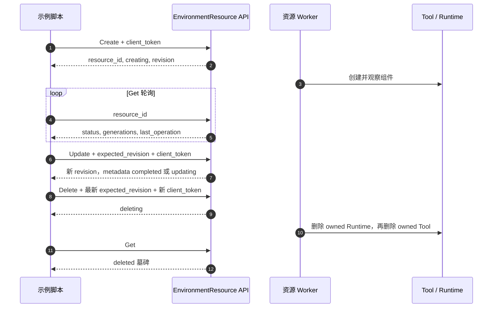

# EnvironmentResource 示例接口核对记录

核对日期：2026-09-24。源码基线：`ma-infra@1d73b4fe1ff806fd7634a2ee38b471173d63459b`。仅在 samples 的 `self_hosted_sandbox_http` 目录编写示例，ma-infra 作为只读契约来源。

## 入口与职责

以下源码位置均相对于 ma-infra 仓库。五个接口均已存在，列表为复数 `ListEnvironmentResources`。

| Action | 直接 HTTP 路由 | 生成路由取证 |
| --- | --- | --- |
| CreateEnvironmentResource | `POST /CreateEnvironmentResource` | `api/ma/api.hertz.pb.go:473` |
| GetEnvironmentResource | `POST /GetEnvironmentResource` | `api/ma/api.hertz.pb.go:475` |
| ListEnvironmentResources | `POST /ListEnvironmentResources` | `api/ma/api.hertz.pb.go:477` |
| UpdateEnvironmentResource | `POST /UpdateEnvironmentResource` | `api/ma/api.hertz.pb.go:479` |
| DeleteEnvironmentResource | `POST /DeleteEnvironmentResource` | `api/ma/api.hertz.pb.go:481` |

调用链为生成路由 → `internal/ma/service/environment.go:17` 或 `internal/ma/service/environment_resource.go:42` → `internal/ma/usecase/environment_resource.go` → resource repository / 异步 worker → Tool、Runtime 云客户端。

`EnvironmentResource` 管理资源组，`Environment` 是输入的目标环境，`Session` 是另外的运行时对象。原始 `01_create_environment_resource.py` 中的 `CreateSession` 调用已改成新式资源组协议。

TOP `/?Action=...&Version=...` 是外部 OpenAPI 入口，须由部署的平台注册并映射到上述路由。后端路由存在不证明生产或 BytePlus 平台已经发布。示例保留 AK/SK 签名入口；显式设置 `MA_RESOURCE_BASE_URL` 时使用直连路径和账号级 `x-api-key`，不注入可信账号头。身份边界参考 `internal/ma/server/http.go:47`，Action 层限制账号级 principal；实际部署能否直连取决于所开放的入口及认证配置。

## 请求与响应

取证：`repository/vo/ma/catalog/environment_resource.go:17` 定义规格，`:47` 定义 Get/Update/Delete 请求，`:56` 定义 List；`repository/vo/ma/catalog/environment.go:45` 定义 Create；`api/ma/message.proto:1766` 定义响应。

- 使用 `resource_id`、`client_token`、`expected_revision` 等原始 snake_case 字段。直接 HTTP 返回资源对象；List 返回 `data`、`next_page`。TOP 成功可能直接透传对象，也可能从 `Result` 解包；根据响应结构判断，并校验资源或列表字段。
- Ark 只接受 `runtime_and_sandbox`，profile 为 `ark_skills`，`runtime` 可为 `{}`，创建及规格更新携带 write-only `target.environment_key`。
- AgentKit 只接受 `sandbox_only`，profile 为 `ma_infra`，省略 `runtime` 和外部 Key；目标为账号下未归档且无活动绑定的 cloud Environment。
- 新式创建不接受 packages / RuntimeTemplate，也不能混入旧式顶层字段。模式校验和归一化参考 `internal/ma/usecase/environment_resource.go:33`、`:96`，混合协议拒绝逻辑见 `:219`。
- Update 明确提交非空 `update_mask`，覆盖 name、description、sandbox.image_url/resources/networking/env_vars 六条路径；字段值仍放在原位置。`description:null`、`env_vars:{}` 保留清空语义。实现见 `internal/ma/usecase/environment_resource.go:470`。
- 同 token 重试必须保留原参数及原 expected_revision；创建、更新、删除命令的 token 均可选，省略时生成并打印本次操作的 token；手动重试必须显式传回原 token。HTTP 自动重试不换 token 或刷新并发版本。Update/Delete 默认从本地状态 JSON 的同一快照读取 resource_id 和 revision；显式参数可覆盖，自动复用版本时检查 ID 和入口一致。Get 当前 revision 写回 JSON，供下一次独立操作使用；手动重试时若 JSON 已变化，应显式传回原 ID 和 revision。幂等实现见 `internal/ma/usecase/environment_resource.go:52`；List 游标和筛选绑定见 `:425`。

## 异步完成与失败



创建/规格更新的成功必须同时满足资源 `ready`、操作 `completed`、期望与观察代次一致；纯元数据完成不要求产生新代次。更新失败回滚可能保留 `ready`，但其 `last_operation.status=failed_clean` 且旧代次仍生效，不能报更新成功。取证：`internal/ma/usecase/environment_resource_worker.go:457`，回滚分支在 `:485`，发布代次在 `:528`；元数据完成在 `internal/ma/usecase/environment_resource.go:638`。

删除以资源 `deleted` 且操作 `completed` 为完成条件。`failed`、`delete_failed`、失败操作、操作被替换、轮询超时均不会输出 `phase=completed`。默认输出中文摘要，展示资源 ID、状态、版本、可用组件 ID，以及成功或失败原因；`--json` 保留完整脱敏事件。摘要与轮询共用完成判定，异步受理不会显示成功。本地仅缓存资源标识与状态，不保存 Key 或自定义环境变量。

## 验证记录

在 samples 仓库根目录执行：

```bash
python3 -m unittest discover -s python/01-tutorials/04-agentkit-tools/self_hosted_sandbox_http/tests -v
uvx ruff==0.11.12 check python/01-tutorials/04-agentkit-tools/self_hosted_sandbox_http
uvx ruff==0.11.12 format --check python/01-tutorials/04-agentkit-tools/self_hosted_sandbox_http
```

19 个本地模拟 HTTP 测试通过；Ruff 检查和格式检查通过。测试覆盖五接口调用、直连鉴权头、Volcengine/BytePlus TOP 请求路径/签名头/请求摘要与响应解包、原样重试、分页、空对象清空字段、资源缓存、脱敏、失败回滚、操作变更、代次不一致超时、元数据完成及中文摘要的受理/成功/失败区分。模拟服务不验证云端签名认证或资源供应。

2026-09-24 补充只读线上验证：Volcengine `open.volcengineapi.com` 的 List 返回 HTTP 200，顶层为 `data/next_page/RequestId`；修复后的 Get 成功读取顶层资源对象并恢复本地状态。用户先前的创建已被受理，但该资源为 `failed`，操作为 `failed_clean`，Sandbox 组件记录 `Provider.InvalidParameter.RoleName`，无云组件 ID；不能将解析修复报告为创建成功。

本次未重新提交 Create/Update/Delete，未修改云端配置、角色或发布接口；完整生命周期和 BytePlus 尚未验证。Ark Tool 的 RoleName 取自 `internal/ma/usecase/environment_resource_worker.go:277` 的 `Resident.RoleName`，经 `internal/ma/data/ma.go:74` 来自 `MA_RUNTIME_ROLE_NAME`（`internal/ma/conf/config.go:91`）。实际部署配置及目标账号角色尚未核验。
