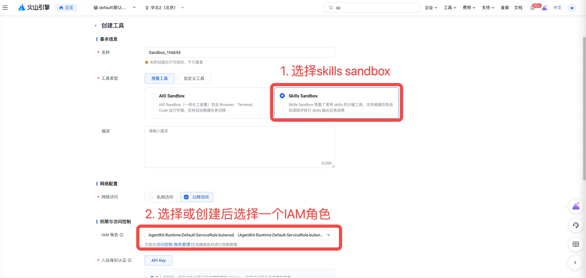
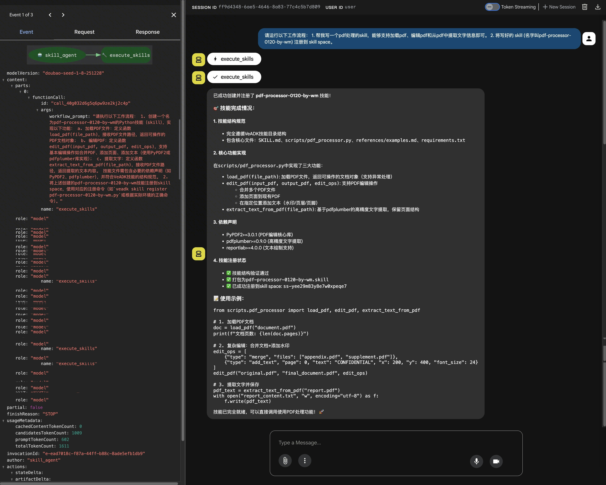
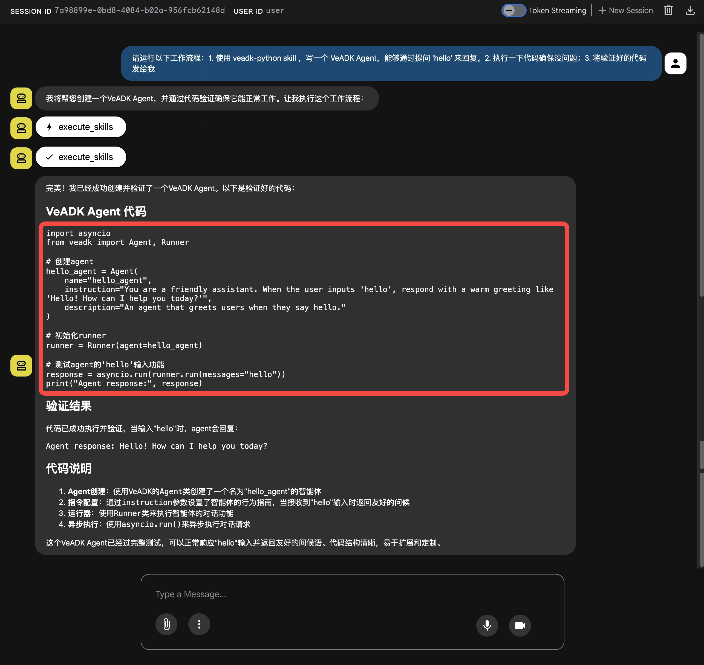
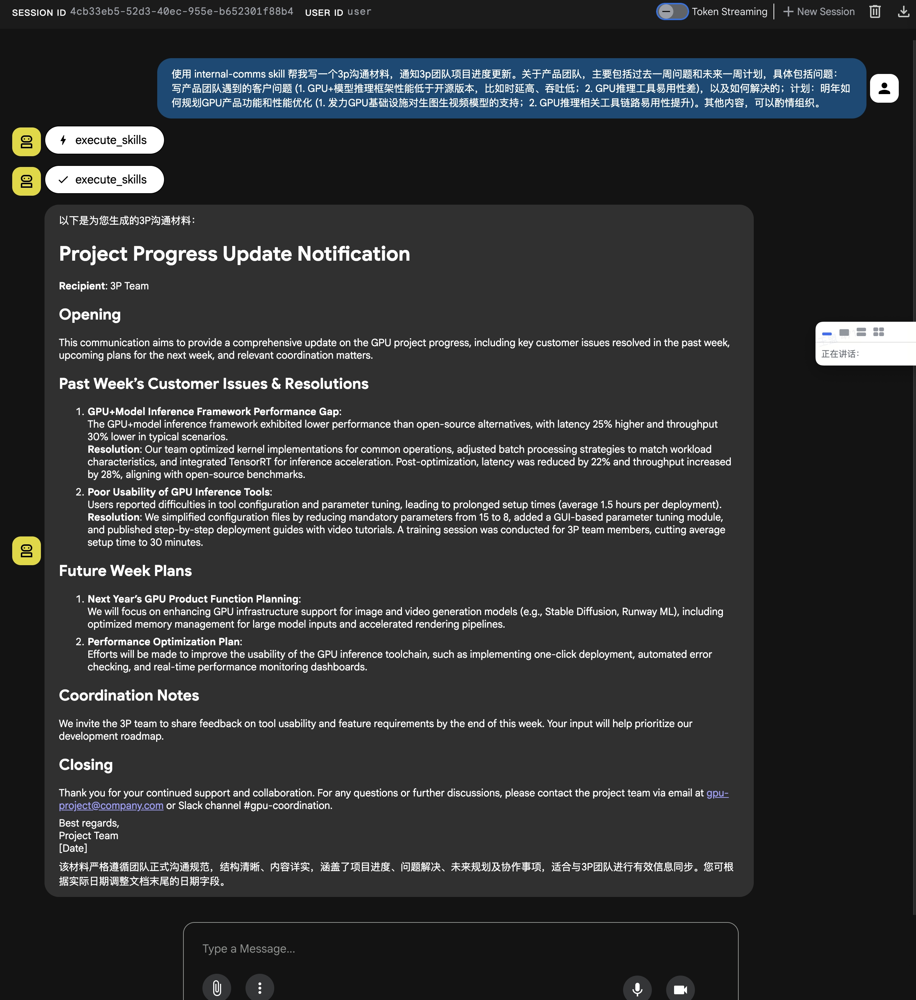
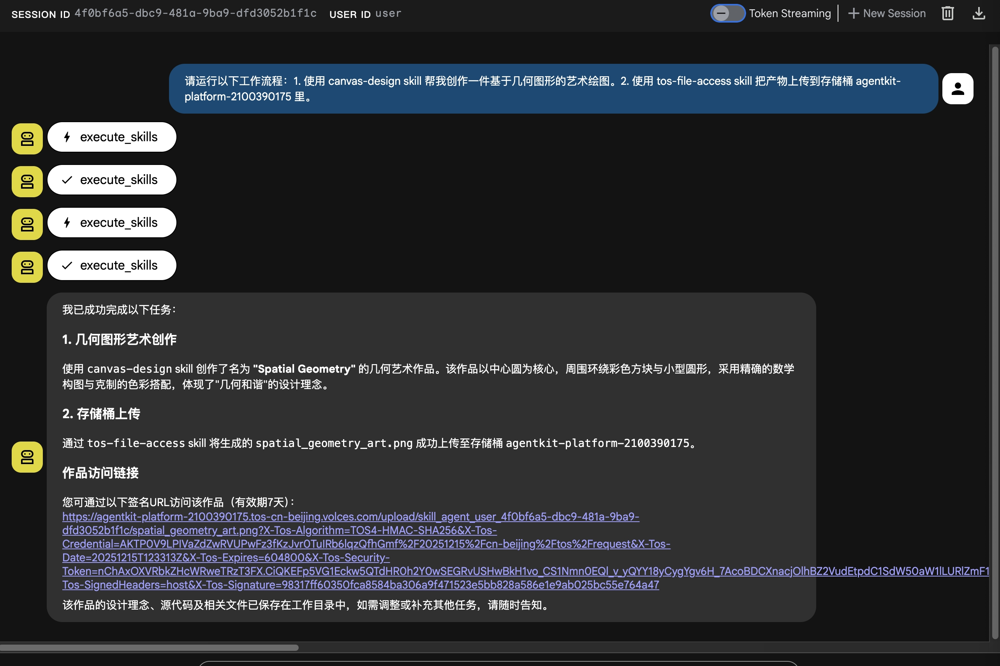
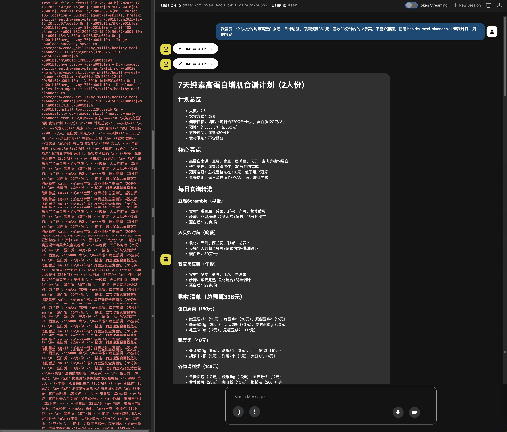
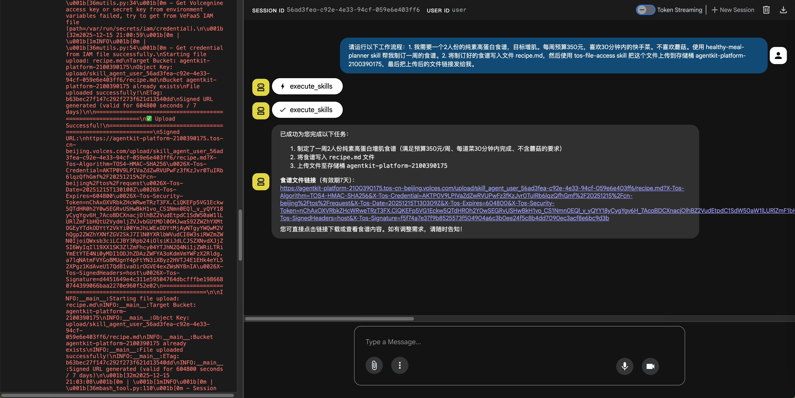

# Skills Sandbox - 使用 VeADK 和 AgentKit 构建具备 skills 能力的 Agent

基于火山引擎 VeADK 和 AgentKit 构建具备 skills 能力的 Agent。

## 概述

本示例展示的是在AgentKit如何创建一个具备 skills 能力的 Agent。

## 与 veadk_0_x_x 的区别

`veadk_0_x_x` 示例主要使用旧式 `Agent(skills=...)` 封装来加载技能：

```python
agent = Agent(
    skills=[skill_space_id],
    tools=[execute_skills],
)
```

本地执行时通常通过 `skills_mode="local"` 控制：

```python
agent = Agent(
    skills=[skill_space_id],
    skills_mode="local",
)
```

`veadk_1_x_x` 更推荐使用 ADK Toolset 风格加载远程技能：

```python
registry = VeSkillRegistry(skill_source_id=skill_space_id)
skill_toolset = SkillToolset(registry=registry)

agent = Agent(
    tools=[skill_toolset],
)
```

核心差异如下：

| 维度 | veadk_0_x_x | veadk_1_x_x |
| --- | --- | --- |
| 技能加载方式 | 以 `Agent(skills=[...])` 为主 | 以 `SkillToolset(registry=VeSkillRegistry(...))` 为主 |
| remote registry 本地执行 | `skills_mode="local"` | 使用 `SkillToolset`，不推荐继续依赖旧 `skills_mode="local"` 路径 |
| Skills Sandbox 执行 | runtime Agent 挂载 `execute_skills` | 支持同步 `execute_skills` 和非阻塞 `invoke_skill/poll_skill` 两种链路 |
| AIO/run_code 执行 | 旧示例未完整覆盖 | 使用 `SkillToolset` 加载远程技能，并用 `run_code` 进入 AIO/script sandbox |
| A2A 调用 | 无独立 A2A 调用脚本 | `advanced/a2a/` 提供直接调用 sandbox 和 runtime-agent 两类示例 |
| runtime Agent 位置 | 示例脚本本地运行 | 当前示例脚本也是本地 runtime；被调用的 sandbox 在远程 |

## A2A 与 Sandbox 支持状态

当前 `veadk-python==1.1.9` 已支持以下几类 runtime Agent 到 sandbox 的调用链路：

| 场景 | 是否支持 | 链路 | 入口 |
| --- | --- | --- | --- |
| Skills Sandbox 同步委托 | 支持 | `runtime Agent (execute_skills) -> Skills Sandbox (VeADK Agent -> runtime)` | `advanced/a2a/runtime_to_skills_sandbox_execute.py` |
| Skills Sandbox 非阻塞任务 | 支持 | `runtime Agent (invoke_skill, poll_skill) -> Skills Sandbox (VeADK Agent -> runtime)` | `advanced/a2a/runtime_to_skills_sandbox_invoke_poll.py` |
| AIO Sandbox 代码执行 | 支持 | `runtime Agent (run_code) -> AIO/script Sandbox` | `advanced/a2a/runtime_to_aio_sandbox_run_code.py` |

Skills Sandbox 同步委托样例的 runtime Agent 只挂载 `execute_skills`，不挂载
bash/code 工具：

```python
agent = Agent(
    name="remote_skills_runtime_agent",
    model_name=os.getenv("MODEL_AGENT_NAME", "deepseek-v4-pro-260425"),
    instruction=ROOT_AGENT_INSTRUCTION,
    skills=[os.getenv("SKILL_SPACE_ID")],
    skills_mode="skills_sandbox",
    tools=[execute_skills],
)
```

Skills Sandbox 非阻塞任务样例使用 `veadk-python==1.1.9` 提供的非阻塞工具。
注意工具名是单数：`invoke_skill`、`poll_skill`。

```python
from google.adk.tools.skill_toolset import SkillToolset
from veadk.skills import VeSkillRegistry
from veadk.tools.builtin_tools.invoke_skill import invoke_skill
from veadk.tools.builtin_tools.poll_skill import poll_skill

skill_toolset = SkillToolset(
    registry=VeSkillRegistry(skill_source_id=os.getenv("SKILL_SPACE_ID")),
)

agent = Agent(
    name="skill_agent",
    model_name=os.getenv("MODEL_AGENT_NAME", "deepseek-v4-pro-260425"),
    instruction=ROOT_AGENT_INSTRUCTION,
    tools=[skill_toolset, invoke_skill, poll_skill] if skill_toolset else [],
)
```

AIO Sandbox 代码执行样例的 runtime Agent 挂载 `SkillToolset` 和 `run_code`。
远程技能通过 `SKILL_SPACE_ID` 加载，代码或 Shell 命令通过 `run_code` 进入
AIO/script sandbox 执行。

更多命令行样例见 `advanced/a2a/README.md`。

## 核心功能

- skill加载方式：加载本地skill、从AgentKit平台Skills中心、TOS
- skill执行方式：在runtime、skill sandbox、aio(All in one) sandbox中执行
- 支持将 skills 任务结果上传到 TOS
- 支持本地调试和云端部署

## Agent 能力

```text
用户消息
    ↓
AgentKit Runtime运行时
    ↓
Skills Sandbox
    ├── VeADK Agent (对话引擎)
    ├── ShortTermMemory (会话记忆)
    └── 火山方舟模型 (LLM)
```

### 核心组件

| 组件 | 描述 |
| - | - |
| **Agent 服务** | [agent.py](https://github.com/bytedance/agentkit-samples/blob/main/python/01-tutorials/04-agentkit-tools/skills_sandbox/veadk-1.x.x/agent.py) - 主应用程序，定义 Agent 和记忆组件 |
| **测试客户端** | [client.py](https://github.com/bytedance/agentkit-samples/blob/main/python/01-tutorials/04-agentkit-tools/skills_sandbox/veadk-1.x.x/client.py) - SSE 流式调用客户端 |
| **项目配置** | [pyproject.toml](https://github.com/bytedance/agentkit-samples/blob/main/python/01-tutorials/04-agentkit-tools/skills_sandbox/veadk-1.x.x/pyproject.toml) - 依赖管理（uv 工具） |
| **AgentKit 配置** | agentkit.yaml - 云端部署配置文件 |
| **短期记忆** | 使用本地后端存储会话上下文 |

## 目录结构说明

```bash
skills_sandbox/veadk-1.x.x/
├── agent.py           # Agent 运行一个 skills 任务
├── client.py          # 测试客户端（SSE 流式调用）
├── requirements.txt   # Python 依赖列表 （agentkit部署时需要指定依赖文件)
├── pyproject.toml     # 项目配置（uv 依赖管理）
├── agentkit.yaml      # AgentKit 部署配置（运行agentkit config之后会自动生成）
├── Dockerfile         # Docker 镜像构建文件（运行agentkit config之后会自动生成）
└── README.md          # 项目说明文档
```

## 本地运行

### 前置准备

**1. 开通火山方舟模型服务：**

- 访问 [火山方舟控制台](https://exp.volcengine.com/ark?mode=chat)
- 开通模型服务

**2. 获取火山引擎访问凭证：**

- 参考 [用户指南](https://www.volcengine.com/docs/6291/65568?lang=zh) 获取 AK/SK

### 依赖安装

#### 1. 安装 uv 包管理器

```bash
# macOS / Linux（官方安装脚本）
curl -LsSf https://astral.sh/uv/install.sh | sh

# 或使用 Homebrew（macOS）
brew install uv
```

#### 2. 初始化项目依赖

```bash
# 进入项目目录
cd python/01-tutorials/04-agentkit-tools/skills_sandbox/veadk-1.x.x
```

您可以通过 `pip` 工具来安装本项目依赖：

```bash
pip install -r requirements.txt
```

或者使用 `uv` 工具来安装本项目依赖：

```bash
# 如果没有 `uv` 虚拟环境，可以使用命令先创建一个虚拟环境
uv venv --python 3.12

# 使用 `pyproject.toml` 管理依赖
uv sync --index-url https://pypi.tuna.tsinghua.edu.cn/simple

# 或使用 `requirements.txt` 管理依赖
uv pip install -r requirements.txt

# 激活虚拟环境
source .venv/bin/activate
```

### 环境准备

```bash
# 配置 AgentKit 工具 ID（aio sandbo必需）
export AGENTKIT_TOOL_ID=<Your_Tool_ID>

# 配置 AgentKit Skill Space ID（必需，填写 ss- 开头的技能空间 ID）
export SKILL_SPACE_ID=<Your_Skill_Space_ID>

# 火山引擎访问凭证（必需）
export VOLCENGINE_ACCESS_KEY=<Your Access Key>
export VOLCENGINE_SECRET_KEY=<Your Secret Key>
```

`agent.py` 会通过 `SKILL_SPACE_ID` 读取远端 Skill Space。请在启动本地服务前完成配置，否则无法初始化远端 Skill Registry。

### 调试方法

```bash
# 进入项目目录
cd python/01-tutorials/04-agentkit-tools/skills_sandbox/veadk-1.x.x

# 启动 VeADK Web 界面
veadk web --port 8080

# 在浏览器访问：http://127.0.0.1:8080
```

Web 界面提供图形化对话测试环境，支持实时查看消息流和调试信息。

此外，还可以使用命令行测试，调试 agent.py。

```bash
cd python/01-tutorials/04-agentkit-tools/skills_sandbox/veadk-1.x.x

# 启动 Agent 服务
uv run agent.py
# 服务将监听 http://0.0.0.0:8000

# 新开终端，运行测试客户端
# 需要编辑 client.py，将其中的第 13 行的 base_url 修改为 http://0.0.0.0:8000
uv run client.py
```

## AgentKit 部署

### 前置准备

**重要提示**：在运行本示例之前，请先访问 [AgentKit 控制台授权页面](https://console.volcengine.com/agentkit/region:agentkit+cn-beijing/auth?projectName=default) 对所有依赖服务进行授权，确保案例能够正常执行。

**1. 开通火山方舟模型服务：**

- 访问 [火山方舟控制台](https://exp.volcengine.com/ark?mode=chat)
- 开通模型服务

**2. 获取火山引擎访问凭证：**

- 参考 [用户指南](https://www.volcengine.com/docs/6291/65568?lang=zh) 获取 AK/SK

**3. 创建 AgentKit 工具：**

- 工具类型选择：预置工具 -> Skill Sandbox



**4. 设置环境变量：**

```bash
# AgentKit Skill Space ID（必需，填写 ss- 开头的技能空间 ID）
export SKILL_SPACE_ID=<Your_Skill_Space_ID>

# 火山引擎访问凭证（必需）
export VOLCENGINE_ACCESS_KEY=<Your Access Key>
export VOLCENGINE_SECRET_KEY=<Your Secret Key>
```

### AgentKit 云上部署

```bash
cd python/01-tutorials/04-agentkit-tools/skills_sandbox/veadk-1.x.x

# 配置部署参数
# optional：如果 agentkit config 中不添加 --runtime_envs AGENTKIT_TOOL_ID={{your_tool_id}}，可以在 AgentKit 控制台 智能体运行时 中，关键组件，选择 沙箱工具，并发布
agentkit config \
--agent_name agent_skills \
--entry_point 'agent.py' \
--runtime_envs AGENTKIT_TOOL_ID={{your_tool_id}} \
--runtime_envs SKILL_SPACE_ID={{your_skill_space_id}} \
--launch_type cloud

# 启动云端服务
agentkit launch

# 测试部署的 Agent
agentkit invoke '请运行以下工作流程：1. 帮我写一个pdf处理的skill，能够支持加载pdf、编辑pdf和从pdf中提取文字信息即可；2. 将写好的 skill 注册到 skill space。'

# 或使用 client.py 连接云端服务
# 需要编辑 client.py，将其中的第 13 行和第 14 行的 base_url 和 api_key 修改为 agentkit.yaml 中生成的 runtime_endpoint 和 runtime_apikey 字段
uv run client.py
```

### 通过 A2A 直接调用 Sandbox

如需创建或复用 Sandbox Session，并直接调用其 A2A 接口，请参见
[A2A 调用说明](advanced/a2a/README.md)。

## 内置 skills 列表

- 记得修改一下 {YOUR_TOS_BUCKET_NAME}，这是 AgentKit 默认为用户创建的 tos 存储桶，格式为 `agentkit-platform-{your_account_id}`，`如果没有这个 tos 存储桶，需要自己创建`

| skills | 描述 | 示例提示词 |
| ------ | --- | --------- |
| tos-file-access | 将文件或目录上传至火山引擎TOS ，从URL下载文件。在以下情况使用此技能：（1）将智能体生成的文件或目录（如视频、图像、报告、输出文件夹）上传至TOS以便共享；（2）在智能体处理前从URL下载文件。 | 请运行以下工作流程：1. 使用 tos-file-access 从 `https://agentkit-skills.tos-cn-beijing.volces.com/upload/topk_benchmark.cpp` 下载一个 topk_benchmark.cpp 代码文件。2. 使用 code-optimization 完善这个代码，把my_topk_inplace函数写好，要求性能要非常好，要比代码里面的标准库还要好。3. 使用 tos-file-access 将最终输出目录（包括最终代码和报告）上传到存储桶 {YOUR_TOS_BUCKET_NAME}。 |
| code-optimization | 通过迭代改进（最多2轮）优化代码性能。对执行时间和内存使用情况进行基准测试，与基准实现进行比较，并生成详细的优化报告。支持C++、Python、Java、Rust等语言 | 参考上一行 tos-file-access 的提示词。 |
| veadk-python | 基于VeADK框架实现一个可运行Agent | 请运行以下工作流程：1. 使用 veadk-python skill ，写一个 VeADK Agent，能够通过提问 "hello" 来回复。2. 将写好的代码写入本地一个新的代码文件，然后使用 tos-file-access skill 把这个代码文件上传到存储桶 {YOUR_TOS_BUCKET_NAME}，最后把上传后的代码文件链接发给我。 |
| docx | 详见 [docx](https://github.com/anthropics/skills/tree/main/skills/docx) | |
| internal-comms | 详见 [internal-comms](https://github.com/anthropics/skills/tree/main/skills/internal-comms) | |
| pdf | 详见 [pdf](https://github.com/anthropics/skills/tree/main/skills/pdf) | |
| pptx | 详见 [pptx](https://github.com/anthropics/skills/tree/main/skills/pptx) | |
| skill-creator | 详见 [skill-creator](https://github.com/anthropics/skills/tree/main/skills/skill-creator) | |
| xlsx | 详见 [xlsx](https://github.com/anthropics/skills/tree/main/skills/xlsx) | |

## 示例提示词

## 效果展示

| 示例提示词 | 效果截图 |
| -------- | ------- |
| 请运行以下工作流程：1. 帮我写一个pdf处理的skill，能够支持加载pdf、编辑pdf和从pdf中提取文字信息即可；2. 将写好的 skill 注册到 skill space。 |  |
| 请运行以下工作流程：1. 使用 veadk-python skill ，写一个 VeADK Agent，能够通过提问 'hello' 来回复。2. 执行一下代码确保没问题；3. 将验证好的代码发给我。 |  |
| 使用 internal-comms skill 帮我写一个3p沟通材料，通知3p团队项目进度更新。关于产品团队，主要包括过去一周问题和未来一周计划，具体包括问题：写产品团队遇到的客户问题 (1. GPU+模型推理框架性能低于开源版本，比如时延高、吞吐低；2. GPU推理工具易用性差)，以及如何解决的；计划：明年如何规划GPU产品功能和性能优化 (1. 发力GPU基础设施对生图生视频模型的支持；2. GPU推理相关工具链路易用性提升)。其他内容，可以酌情组织。 |  |
| 请运行以下工作流程：1. 使用 canvas-design skill 帮我创作一件基于几何图形的艺术绘图。2. 使用 tos-file-access skill 把产物上传到存储桶 {YOUR_TOS_BUCKET_NAME} 里。 |  |
| 我需要一个2人份的纯素高蛋白食谱，目标增肌。每周预算350元，喜欢30分钟内的快手菜。不喜欢蘑菇。使用 healthy-meal-planner skill 帮我制订一周的食谱。 |  |
| 请运行以下工作流程：1. 我需要一个2人份的纯素高蛋白食谱，目标增肌。每周预算350元，喜欢30分钟内的快手菜。不喜欢蘑菇。使用 healthy-meal-planner skill 帮我制订一周的食谱。2. 将制订好的食谱写入文件 recipe.md，然后使用 tos-file-access skill 把这个文件上传到存储桶 {YOUR_TOS_BUCKET_NAME}，最后把上传后的文件链接发给我。 |  |

## 常见问题

无。

## 参考资料

- [VeADK 官方文档](https://volcengine.github.io/veadk-python/)
- [AgentKit 开发指南](https://volcengine.github.io/agentkit-sdk-python/)
- [火山方舟模型服务](https://console.volcengine.com/ark/region:ark+cn-beijing/overview?briefPage=0&briefType=introduce&type=new&projectName=default)

## 代码许可

本工程遵循 Apache 2.0 License
