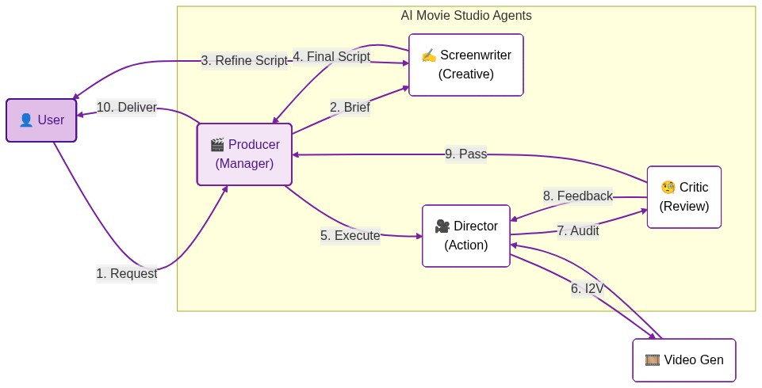
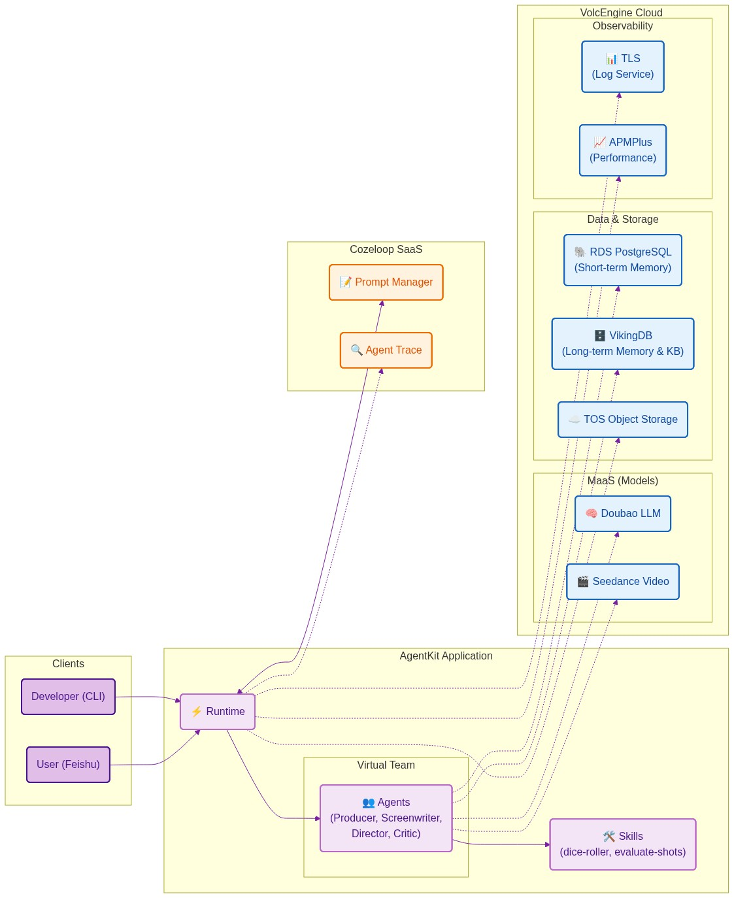

# 🎬 AI Movie Studio (AI 影业)

**基于 AgentKit 的企业级多 Agent 协同影视制作系统**

> *让每个人都能成为制片人，让 AI 帮你搞定编剧、导演和影评人。*

## 📖 项目背景

随着 **Seedance 2.0 (即梦)** 等新一代视频生成模型的发布，AI 视频的画质、连贯性和可控性迎来了**指数级的飞跃**。生成一段电影级画质的视频不再是遥不可及的梦想，而是触手可及的现实。

然而，尽管底层模型能力突飞猛进，普通用户在创作时仍面临三大痛点：
1.  **创意匮乏 ("不知道拍啥")**：面对空白的输入框，不知道如何构思引人入胜的故事。
2.  **技术门槛 ("不会写很好的提示词剧本")**：不懂光影、镜头语言，写不出高质量的 Prompt。
3.  **质量失控 ("生成质量差全靠随机抽卡")**：生成的视频画风崩坏、逻辑错误，需要反复手动重试。

**AI Movie Studio** 通过构建一个由多个专家 Agent 组成的**虚拟制片团队**（包含**统筹全局的制片人**、**创意无限的编剧**、**精通技术的导演**以及**严格把关的影评人**），通过**SOP（标准作业程序）**和**自动化迭代闭环**，解决上述问题，交付高质量的**单镜头精品视频**。

---

## 🏗️ 核心架构

本系统采用星型（Hub-and-Spoke）拓扑结构，以 **Producer (制片人)** 为核心枢纽，协调 **Creative (创意)**、**Action (执行)** 和 **Review (评审)** 三大职能。

### 架构图 (Architecture)

**场景架构 (Scenario Architecture)**


**技术架构 (Technical Architecture)**


### 👥 虚拟团队角色

| 角色 | ID | 职责 (SOP) | 核心工具 |
| :--- | :--- | :--- | :--- |
| **制片人 (Producer)** | `producer_agent` | **总控路由**：需求拆解、任务分发、进度管理、**用户意图确认 (STOP & ASK)**。 | `execute_skills` (代码沙箱) |
| **首席编剧 (Screenwriter)** | `screenwriter_agent` | **创意孵化**：通过**渐进式引导** (含开放式脑洞)，将模糊想法转化为可执行的单镜头脚本 (含 Timeline)。 | `web_search`, `execute_skills` |
| **技术导演 (Director)** | `director_agent` | **视觉执行**：图生视频 (I2V)、运镜控制。 | `image_generate` (首帧), `video_generate` (生成), `execute_skills` |
| **毒舌影评人 (Critic)** | `critic_agent` | **质量把关**：视觉审计、一致性检查、量化评分。 | `execute_skills` (evaluate-shots) |

## 🌟 Agent 能力 (Agent Capabilities)

本项目充分利用了 **Doubao** 系列模型与 **AgentKit** 的强大能力：

*   **多模态大模型 (Doubao-Seed-1.8)**: 
    *   原生支持**图生文 (VLM)**：Screenwriter 可直接读取用户图片进行剧本扩写。
    *   **深度推理**：Producer 使用 CoT (Chain of Thought) 进行复杂的任务路由。
*   **视频生成模型 (Doubao-Seedance)**:
    *   支持高质量的 **Text-to-Image** (首帧) 和 **Image-to-Video** (视频) 生成。
*   **企业级知识库 (VikingDB)**:
    *   存储专业的 Prompt 模板，通过 RAG 增强编剧的专业度。
*   **持久化记忆 (PostgreSQL)**:
    *   记录用户偏好与历史项目，实现长程记忆。
*   **代码沙箱 (Skill Sandbox)**:
    *   支持动态执行 Python 代码，用于文件处理、数据清洗等任务。

---

## ✨ 核心特性 (Key Features)
### 1. 🎯 分镜式生成策略 (Shot-by-Shot Generation)
采用标准的分镜脚本工作流，但专注于**单片段的极致打磨**，规避复杂的后期剪辑。
- **I2V 优先**：先生成完美首帧图，再生成视频，锁定画风一致性。
- **时间轴控制 (Timeline)**：精确控制每一秒的动作变化 (e.g., `0s-2s: 静止`, `2s-4s: 动作`)。
- **运镜控制**：在 Prompt 中显式控制 Zoom/Pan/Dolly，用镜头语言讲故事。

### 2. 🧠 渐进式创意引导 (Guided Creativity)
编剧 Agent 不再是被动的执行者，而是**主动的创意导师**。
- **三步引导**：Style (风格) -> Subject (主体) -> Setting (场景)，每一步均支持**开放式输入 (Open-Ended)**，激发用户脑洞。
- **强制确认 (Final Check)**：在开拍前，强制展示完整脚本并提供 **“直接开拍 / 申请质检 / 继续修改”** 三选一决策，拒绝“盲盒式”生成。

### 3. 🛠️ 强大的执行能力与扩展性 (Skill Sandbox & Extensibility)
全员配备 `execute_skills` 工具，赋予 Agent **代码执行能力**，并预留了 Skill Sandbox 接口，方便未来扩展更多自定义技能。
- **导演**：可以使用 Python 脚本批量处理图片、重命名文件。
- **编剧**：可以编写爬虫抓取最新的流行梗。
- **影评人**：通过调用自定义 Skill `evaluate-shots`（基于 VLM），对画面进行视觉审计和内容一致性评估，实现评审逻辑的解耦与热更新。
- **Skill Sandbox & Skill Center**: 无缝对接 **AgentKit Skill 中心**，通过 `execute_skills` 工具在安全的沙箱环境中动态调用云端 Skill。
    - **动态热更新**: 无论是新增能力（如“命运之骰”）还是修复逻辑，只需在 Skill 中心发布新版本，Agent **无需重新部署或重启**即可即时生效。
    - **生态复用**: 直接复用社区或企业沉淀的通用 Skill（如文档处理、数据分析），快速扩展 Agent 能力边界。

### 5. 🎲 彩蛋：命运之骰 (The Dice of Destiny)
当用户患有“选择困难症”时（例如说“随便”、“不知道拍什么”），编剧 Agent 会调用自定义 Skill `dice-roller`，通过掷骰子来随机决定风格或剧情走向，增加互动的趣味性。
- **技术实现**：展示了如何开发自定义 Python Skill，上传至 AgentKit Skill 中心，并通过 `execute_skills` 工具在 Agent 中动态调用。
- **配置**：需配置 `AGENTKIT_TOOL_ID` 和 `SKILL_SPACE_ID`。

### 6. 🏢 企业级工程能力 (Enterprise Ready)
基于 `car_selector` 的最佳实践，全员注入企业级能力：
- **App 架构**：采用 `AgentkitA2aApp` 和 `A2aAgentExecutor` 构建，集成 `EventsCompaction` (记忆压缩)，有效管理长对话上下文。
- **独立部署**：每个 Agent 拥有独立的 `agentkit.yaml`、`simple_agent.py` 入口和 `utils.py`，支持解耦部署和独立扩展。
- **Memory**: 独立数据库 `ai_movie_studio_mem_pg_db`，防止数据污染。
- **Observability**: 全链路 OpenTelemetry 追踪。
- **Robustness**: 工具输出自动清洗与 TOS 上传。
- **网络隔离**: 统一的 VPC 和 Subnet 配置，确保云端安全互通。

---

## 🚀 快速开始

### 1. 环境准备
```bash
# 安装依赖 (推荐使用 uv 管理虚拟环境)
uv pip install -r sub_agents/producer/requirements.txt
# 或者
pip install -r sub_agents/producer/requirements.txt
```

### 2. 配置环境变量

**A. 基础鉴权 (config.yaml)**
复制 `config.yaml.example` 为 `config.yaml`，填入火山引擎鉴权信息 (用于本地调试时调用 Ark 等服务)：
```yaml
volcengine:
  access_key: "YOUR_AK"
  secret_key: "YOUR_SK"
```

**B. 业务配置 (.env)**
复制 `.env.example` 为 `.env`，配置数据库和知识库连接信息：
```bash
# PostgreSQL
DATABASE_POSTGRESQL_HOST=...
# VikingDB
DATABASE_VIKING_API_KEY=...
```

**注意**：
- 请确保 PostgreSQL 数据库 `ai_movie_studio_mem_pg_db` 已创建。
- Director Agent 支持配置 `MODEL_VIDEO_NAME` 环境变量来切换视频生成模型（默认为 `doubao-seedance-1-5-pro-251215`）。
    > 💡 **Tip**: 待 **Seedance 2.0** 正式发布后，请在此处切换模型名称，您的用户将立即体验到质的飞跃！
- **提示词管理**：如果您希望动态更新 Prompt 而不重新部署，请配置 `PROMPT_MANAGEMENT_COZELOOP_TOKEN` 和相关环境变量，并在 Cozeloop 平台上管理 Prompt。否则，系统将默认使用本地的 `instruction.md`。
    > 💡 **Tip**: 使用 Cozeloop 管理提示词时，Agent 会自动拉取最新配置，无需重新构建或部署 Agent，非常适合快速迭代优化 Prompt。

### 3. 导入知识库 (Knowledge Base)
为了让编剧 Agent 拥有“大师级”的创作能力，请将提示词模板导入 VikingDB。
1.  **获取文件**：`ai_movie_studio/knowledge/prompt_templates.txt`
2.  **上传**：登录火山引擎 VikingDB 控制台。
3.  **导入**：创建一个新的 Collection (名为 `ai_movie_studio_kb`)，并将上述 TXT 文件作为非结构化数据导入。
4.  **生效**：导入完成后，编剧 Agent 即可通过 RAG 检索到这些高质量提示词。

### 4. 启动服务

**本地调试 (Local Debugging)**：
可以直接使用 `python` 启动各个子 Agent 的服务：
```bash
# 启动 Producer (默认端口 8000)
cd sub_agents/producer
python -m simple_agent
```

**云端部署 (Cloud Deployment)**：
使用 AgentKit CLI 分别部署每个子 Agent：
```bash
# 部署 Producer
cd sub_agents/producer && agentkit launch
# 部署其他 Agent 同理...
```
部署完成后，请在 Producer 的 `agentkit.yaml` 或云端配置中设置子 Agent 的真实 URL 和 Token。

### 5. 对话示例

**场景：渐进式引导**
> **用户**: "我想做一个猫的视频。"
>
> **Screenwriter**: "没问题！我们先来定个调子。您希望这只猫呈现出什么风格？
> A. **皮克斯动画风** (可爱、明亮)
> B. **赛博朋克风** (霓虹灯、机械)"
>
> **User**: "B"
>
> **Screenwriter**: "选得好！在赛博朋克世界里，它在做什么？
> 1. **黑客猫** (敲代码)
> 2. **赏金猎人** (背激光枪)"
> ...

---

## 🖼️ 效果展示 (Showcase)

> *此处建议放入 Demo 视频或运行截图。您可以在 `assets/` 目录下添加您的素材。*

### 核心工作流演示
*(待补充截图：飞书对话截图 / 视频生成结果)*

### 生成样例
*(待补充：生成的首帧图 vs 最终视频)*

---

## ⚙️ 配置与部署 (Configuration & Deployment)

本项目提供了一套完整的工具链，用于从本地开发到云端部署的平滑过渡。

### 1. 本地配置 (Local Config)
每个子 Agent 目录下都有一个 `.env.example` 文件。请将其复制为 `.env` 并填入您的本地调试参数。

**启用高级工具**:
如果您希望 Agent 使用 Web 搜索或代码解释器等高级能力，请配置 `VEADK_BUILTIN_TOOLS_ENABLE` 环境变量：
```bash
# .env
VEADK_BUILTIN_TOOLS_ENABLE="web_search,execute_skills" # 逗号分隔
```
> **注意**: `execute_skills` 工具依赖 `AGENTKIT_TOOL_ID`，请确保同时配置了该 ID。

### 2. 初始化部署配置 (Init Deployment Config)
如果您是首次将 Agent 接入 AgentKit（或者新创建了 Agent），需要生成部署配置文件 `agentkit.yaml`：

```bash
cd sub_agents/critic
# 自动分析 agent.py 生成基础配置
agentkit init --from-agent agent.py
```
此命令会根据您的代码自动生成 `agentkit.yaml` 和 `Dockerfile`。

### 3. 同步配置到云端 (Sync to Cloud)
在本地调试完成后，您可以使用 `scripts/sync_envs.py` 脚本将 `.env` 中的配置自动同步到 `agentkit.yaml`（云端部署文件），避免手动复制粘贴的繁琐和错误。

```bash
# 同步所有子 Agent
python scripts/sync_envs.py

# 仅同步特定 Agent (e.g. critic)
python scripts/sync_envs.py critic
```
该脚本会自动排除本地特有的变量（如 `PORT`, `PYTHONPATH`），确保云端配置的整洁。

### 4. 云端部署 (Deploy)
配置同步完成后，使用 AgentKit CLI 进行部署：

```bash
# 以前端制片人 (Producer) 为例
cd sub_agents/producer
agentkit deploy
```

---

## 📂 目录结构 (Directory Structure)

```bash
ai_movie_studio/
├── LICENSE               # Apache 2.0 许可证
├── README.md             # 项目说明文档
├── project.yaml          # 项目元数据 (Project Metadata)
├── requirements.txt      # 聚合依赖文件 (Aggregated Dependencies)
├── sub_agents/          # 子智能体目录 (原 agents/)
│   ├── producer/        # 制片人 (Router)
│   │   ├── agent.py     # Agent 定义 (标准化入口)
│   │   ├── simple_agent.py # 服务启动入口
│   │   └── ...
│   ├── screenwriter/    # 编剧 (Creative)
│   ├── director/        # 导演 (Action)
│   └── critic/          # 影评人 (Review)
├── skills/              # 自定义技能 (Custom Skills)
│   └── dice-roller/     # 示例 Skill: 掷骰子
│   └── evaluate-shots/  # 视觉评估 Skill (Visual Evaluation)
├── knowledge/           # 知识库数据 (Knowledge Base)
├── assets/              # 静态资源 (Screenshots, Demo Videos)
├── scripts/             # 开发辅助脚本 (Dev Scripts)
└── utils/               # 通用辅助函数目录 (Placeholder)
```
