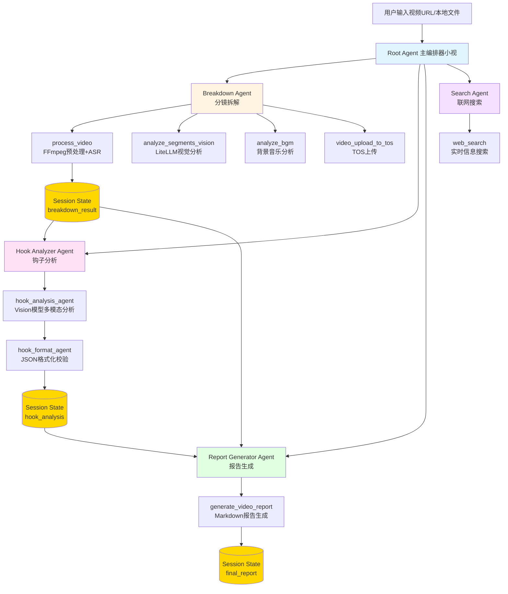
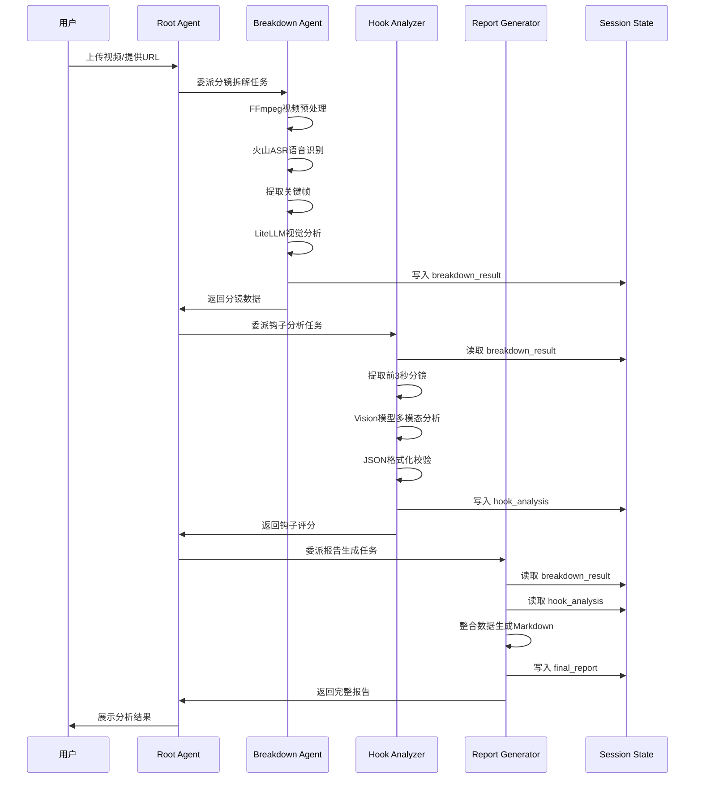
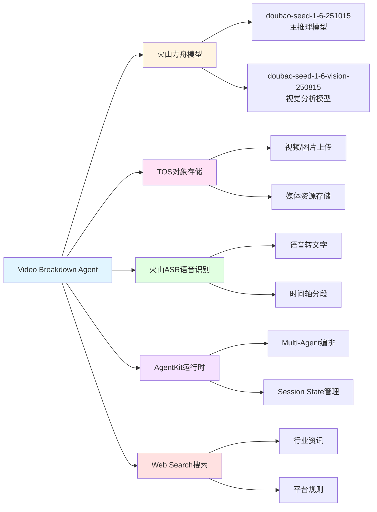

# 技术架构图

## Mermaid 流程图代码

您可以使用以下 Mermaid 代码生成技术架构图，或使用绘图工具创建自定义架构图。

### Multi-Agent 架构流程图

### 数据流转图

### 火山引擎组件集成图

## 生成架构图的方法

### 方法1：使用在线 Mermaid 编辑器

1. 访问 [Mermaid Live Editor](https://mermaid.live/)
2. 复制上述任一 Mermaid 代码
3. 粘贴到编辑器中
4. 导出为 PNG/SVG 图片
5. 保存为 `architecture.jpg` 或其他格式

### 方法2：使用绘图工具

使用 Draw.io、Figma、Excalidraw 等工具绘制自定义架构图：

**建议包含的元素：**
- Root Agent 和 4 个子 Agent
- 每个 Agent 的主要工具函数
- Session State 数据流转
- 火山引擎组件（方舟、TOS、ASR）
- 第三方组件（FFmpeg、LiteLLM）

### 方法3：使用 VS Code 插件

1. 安装 VS Code 插件：`Markdown Preview Mermaid Support`
2. 在 Markdown 文件中查看 Mermaid 图表
3. 截图保存

## 架构图说明

架构图应展示以下关键信息：

1. **Multi-Agent 协作关系**：Root Agent 如何协调 4 个子 Agent
2. **数据流转路径**：Session State 如何在 Agent 之间传递数据
3. **工具调用链路**：每个 Agent 调用哪些工具函数
4. **火山引擎集成**：使用了哪些火山产品和服务
5. **优雅降级机制**：TOS/ASR 失败时的回退路径

## 当前状态

> 架构图文件待补充。建议使用上述 Mermaid 代码生成或自行绘制后保存为 `img/architecture.jpg`。
